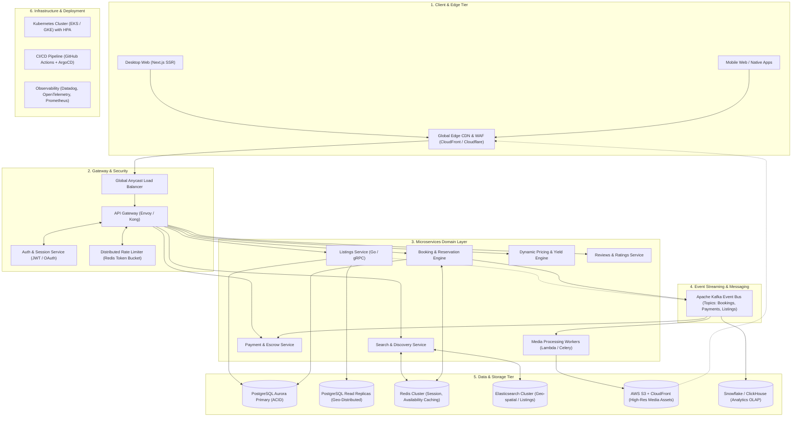

# Production-Scale Architecture: Vacation-Rental Marketplace

This document details the scaling strategy and technical architecture for a production-scale vacation-rental marketplace (modeled after Airbnb), illustrating how the frontend, backend microservices, distributed storage, search engine, and cloud deployment scale to handle millions of concurrent guests and hosts.

---

## 1. System Architecture Overview

---

## 2. Core Architectural Components & Scaling Strategies

### A. Frontend & Edge Tier
- **Next.js App Router with Hybrid Rendering**:
  - Static Generation (SSG / ISR) for listing property pages with stale-while-revalidate caching.
  - Client-side React 19 hydration for high-frequency interactive widgets (dual datepicker calendar, live pricing calculator, photo tour lightbox).
- **Edge CDN & Web Application Firewall (WAF)**:
  - Anycast DNS and Cloudflare/CloudFront edge nodes cache static bundles, responsive WebP/AVIF photos, and public listing metadata close to end-users worldwide.
  - Automated DDoS protection, bot challenge mitigation, and HTTP/3 support.

### B. API Gateway & Security
- **Envoy / Kong API Gateway**:
  - Handles SSL termination, routing to internal gRPC/REST microservices, and CORS policies.
  - **Distributed Rate Limiting**: Redis-backed token bucket algorithm preventing scrapers and brute-force reservation attempts.
  - **Zero-Trust Security**: Mutual TLS (mTLS) with Istio service mesh inside the private VPC.

### C. Core Microservices Architecture
1. **Search & Discovery Service**:
   - Backed by an **Elasticsearch / OpenSearch** cluster with geo-spatial index (`geo_distance`, bounding boxes).
   - Features autocomplete, multi-facet filtering (price bounds, bedrooms, amenities like jacuzzi/wifi), and real-time inventory filtering.
2. **Booking & Reservation Engine**:
   - High-concurrency ACID transactions with optimistic locking in PostgreSQL.
   - **Distributed Double-Booking Prevention**: Employs **Redis Redlock** distributed locks on `listing_id:date` tuples during checkout checkout initiation (holding reservations for 15 minutes before release).
3. **Dynamic Pricing Engine**:
   - Calculates base rates, cleaning fees, taxes, and weekend/seasonal surge pricing with millisecond response times via pre-calculated Redis caches.
4. **Media Processing Pipeline**:
   - Host photo uploads go directly to S3 via pre-signed URLs.
   - S3 bucket notifications trigger asynchronous containerized workers or AWS Lambda to sanitize metadata, generate multi-resolution sizes (thumbnail, mobile, 2k desktop), and generate BlurHash placeholders.

### D. Data Tier & High Availability
- **Primary Relational Database (PostgreSQL Aurora)**:
  - Multi-AZ primary instance for strongly-consistent transactions (bookings, payments, user identities).
  - Read replicas auto-scaled across regions to offload listing read queries with connection pooling (PgBouncer).
- **In-Memory Caching (Redis Cluster)**:
  - Caches listing availability calendar matrices, user session tokens, and frequently accessed host profiles.
- **Event Streaming (Apache Kafka)**:
  - Decoupled asynchronous event pipeline (`BookingCreated`, `PaymentSucceeded`, `ReservationCancelled`, `ReviewSubmitted`).
  - Consumers handle guest email/SMS confirmations, host payouts, analytics telemetry, and search index updates.

### E. Cloud Deployment & DevOps
- **Container Orchestration**: Kubernetes (EKS/GKE) with Horizontal Pod Autoscaler (HPA) scaling pods dynamically based on CPU, memory, and queue lag.
- **GitOps Deployment**: ArgoCD pulling tested container images built via GitHub Actions with canary / blue-green release strategies for zero-downtime rollouts.
- **Observability**: Prometheus & Grafana for infrastructure metrics, OpenTelemetry distributed tracing across microservice hops, and Datadog for APM alerts and error tracking.
